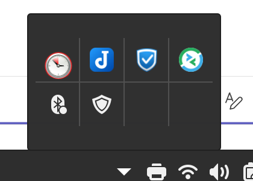

# Linux Mint Cinnamon — Auto Tray Icons

Windows-style hidden tray icons for Linux Mint Cinnamon: app icons auto-hide
behind an expand arrow and show in a centered grid popup, exactly like the
Windows taskbar overflow.



Full feature list and usage: see
[`collapsible-xapp-status@marius/README.md`](collapsible-xapp-status@marius/README.md).

## Manual installation

```bash
cp -r "collapsible-xapp-status@marius/files/collapsible-xapp-status@marius" ~/.local/share/cinnamon/applets/
```

Then:

1. Right-click the panel → **Applets**.
2. **Remove** the stock *System Tray* and *XApp Status Applet* from the panel
   (this applet replaces both — running them together duplicates icons).
3. Add **Collapsible XApp Status Applet** where the tray used to be.

No Cinnamon restart needed. All app icons start hidden — right-click the applet
to choose which ones stay visible on the panel.

## Repository layout

The directory structure follows the
[Cinnamon Spices](https://cinnamon-spices.linuxmint.com/) applet format
(`uuid/info.json`, `uuid/screenshot.png`, `uuid/files/uuid/...`) so it can be
submitted to the official
[cinnamon-spices-applets](https://github.com/linuxmint/cinnamon-spices-applets)
repository as-is.

## License

GPL-2.0-or-later. Portions derived from the stock Cinnamon applets
`xapp-status@cinnamon.org` and `systray@cinnamon.org`.
